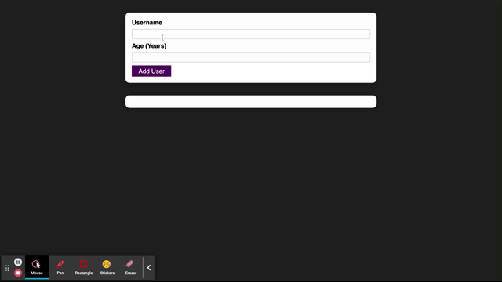

# User aggregator.

A simple application to create a list of users.

[User aggregator app](https://user-aggregator-pxij.vercel.app)

### Stack:

* React

### Application functionality.

### Get started.

Clone the project

`git clone git@github.com:zakharovdm/user_aggregator.git`

Set up the dependencies

`make install`